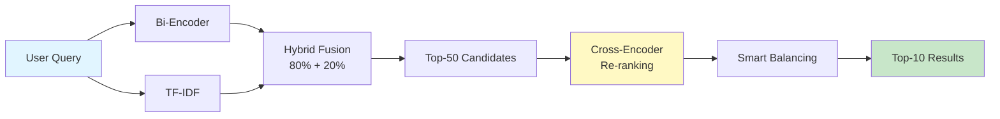

<div align="center">

# 🎯 SHL Assessment Recommendation System

### *AI-Powered Intelligent Assessment Matching for Hiring Excellence*

[](https://opensource.org/licenses/MIT)
[](https://www.python.org/downloads/)
[](https://fastapi.tiangolo.com)
[](https://huggingface.co/spaces/shravyagautam24/SHL_Assignment)

[🚀 Live Demo](https://shravyagautam24-shl-assignment.hf.space) • [📖 Documentation](#api-endpoints) • [💡 Features](#-key-features)

</div>

---

## 🌟 Overview

An **intelligent recommendation system** that revolutionizes how hiring managers discover relevant SHL assessments. Using state-of-the-art **Hybrid RAG (Retrieval-Augmented Generation)** architecture, the system understands natural language queries and job descriptions to deliver precise assessment recommendations.

### 🎬 Quick Demo

```bash
curl -X POST https://shravyagautam24-shl-assignment.hf.space/recommend \
  -H "Content-Type: application/json" \
  -d '{"query": "Java developer with strong communication skills"}'
```

---

## ✨ Key Features

<table>
<tr>
<td width="50%">

### 🧠 **Hybrid RAG Engine**
- **Neural Embeddings**: Sentence Transformers (`all-mpnet-base-v2`)
- **Keyword Search**: TF-IDF for precision matching
- **Weighted Fusion**: 80% semantic + 20% keyword

</td>
<td width="50%">

### 🎯 **Cross-Encoder Re-ranking**
- **Model**: `ms-marco-MiniLM-L-6-v2`
- **Top-50 Candidates**: Re-ranked for accuracy
- **Normalized Scoring**: 0-100% match confidence

</td>
</tr>
<tr>
<td width="50%">

### ⚖️ **Smart Balancing**
- **Domain Detection**: Technical vs. Soft Skills
- **Intelligent Filtering**: Test type optimization
- **Balanced Mix**: Ensures diverse recommendations

</td>
<td width="50%">

### 📊 **Performance Metrics**
- **Mean Recall@10**: 24.1%
- **Assessments Indexed**: 389
- **Response Time**: < 2 seconds

</td>
</tr>
</table>

---

## 🏗️ Architecture



**Pipeline Stages:**
1. **Dual Retrieval**: Neural embeddings + TF-IDF keyword matching
2. **Hybrid Fusion**: Weighted combination of semantic and lexical scores
3. **Re-ranking**: Cross-encoder for precise relevance scoring
4. **Balancing**: Domain-aware filtering (Technical/Soft Skills)

---

## 🚀 Quick Start

### Prerequisites
- Python 3.11+
- pip package manager

### Installation

```bash
# Clone the repository
git clone https://huggingface.co/spaces/shravyagautam24/SHL_Assignment
cd SHL_Assignment

# Install dependencies
pip install -r requirements.txt

# Run the application
python app.py
```

🌐 **Server will start at**: `http://0.0.0.0:7860`

---

## 📡 API Reference

### 🟢 Health Check

**Endpoint**: `GET /health`

Verifies the API is running and ready to serve requests.

**Response**:
```json
{
  "status": "healthy"
}
```

---

### 🔍 Get Recommendations

**Endpoint**: `POST /recommend`

Returns up to 10 relevant assessments based on a natural language query.

**Request**:
```json
{
  "query": "Java developer with communication skills"
}
```

**Response**:
```json
{
  "recommended_assessments": [
    {
      "url": "https://www.shl.com/products/product-catalog/view/java-platform-enterprise-edition-7-java-ee-7/",
      "name": "Java Platform Enterprise Edition 7 (Java EE 7)",
      "adaptive_support": "No",
      "description": "The Java Platform Enterprise Edition 7 (Java EE 7) test measures knowledge of the Java EE 7 architecture...",
      "duration": 30,
      "remote_support": "Yes",
      "test_type": ["K"]
    }
  ]
}
```

**Response Fields**:
| Field | Type | Description |
|-------|------|-------------|
| `url` | String | Direct link to assessment details |
| `name` | String | Assessment name |
| `adaptive_support` | String | "Yes" or "No" indicating adaptive testing |
| `description` | String | Detailed assessment description |
| `duration` | Integer | Estimated completion time (minutes) |
| `remote_support` | String | "Yes" or "No" for remote administration |
| `test_type` | Array | Test categories: K (Knowledge), P (Personality), C (Competencies), A (Abilities), B (Behavioral), S (Simulation) |

---

### 🖥️ Frontend Interface

**Endpoint**: `GET /`

Serves an interactive web interface for non-technical users.

**Features**:
- Natural language query input
- Real-time recommendations
- Assessment details with direct links
- Match confidence scores

---

## 📊 Performance Benchmarks

| Metric | Value | Description |
|--------|-------|-------------|
| **Mean Recall@10** | 24.1% | Percentage of relevant assessments in top-10 |
| **Assessments Indexed** | 389 | Total SHL assessments in database |
| **Average Response Time** | < 2s | End-to-end query processing |
| **Model Size** | 438MB | Bi-encoder model footprint |
| **Embedding Dimension** | 768 | Vector representation size |

---

## 🛠️ Technology Stack

<div align="center">

| Component | Technology |
|-----------|-----------|
| **Backend Framework** | FastAPI 0.121.3 |
| **Bi-Encoder** | Sentence Transformers (all-mpnet-base-v2) |
| **Cross-Encoder** | ms-marco-MiniLM-L-6-v2 |
| **Keyword Search** | Scikit-learn TF-IDF |
| **Web Scraping** | BeautifulSoup4, Requests |
| **Deployment** | Docker, Hugging Face Spaces |

</div>

---

## 📂 Project Structure

```
SHL_Assignment/
├── app.py                      # Application entry point
├── requirements.txt            # Python dependencies
├── Dockerfile                  # Container configuration
├── src/
│   ├── api.py                 # FastAPI routes
│   ├── rag.py                 # RAG engine implementation
│   └── scraper.py             # SHL catalog scraper
├── data/
│   └── assessments.json       # Scraped assessment data
└── frontend/
    └── index.html             # Web interface
```

---

## 🧪 Example Queries

Try these sample queries to see the system in action:

```bash
# Technical Role
curl -X POST http://localhost:7860/recommend \
  -H "Content-Type: application/json" \
  -d '{"query": "Senior Python developer with cloud expertise"}'

# Soft Skills Focus
curl -X POST http://localhost:7860/recommend \
  -H "Content-Type: application/json" \
  -d '{"query": "Team leader with strong communication and conflict resolution"}'

# Hybrid Query
curl -X POST http://localhost:7860/recommend \
  -H "Content-Type: application/json" \
  -d '{"query": "Data analyst who can present insights to stakeholders"}'
```

---

## 🤝 Contributing

Contributions are welcome! Please feel free to submit a Pull Request.

---

## 📄 License

This project is licensed under the MIT License - see the [LICENSE](LICENSE) file for details.

---

<div align="center">

### 🌐 Links

[Live Demo](https://shravyagautam24-shl-assignment.hf.space) • [GitHub Repository](https://github.com/shravya2124/Assignment) • [Hugging Face Space](https://huggingface.co/spaces/shravyagautam24/SHL_Assignment)

---

**Built with ❤️ using FastAPI and Sentence Transformers**

</div>
